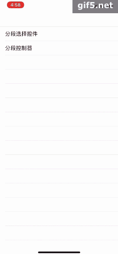

# MHSegmentedControl


[](https://travis-ci.org/menhui222/MHSegmentedControl)
[](https://cocoapods.org/pods/MHSegmentedControl)
[](https://cocoapods.org/pods/MHSegmentedControl)
[](https://cocoapods.org/pods/MHSegmentedControl)
[](https://weibo.com/u/2415625901/home?topnav=1&wvr=6)
## Example



####Usage
Text

```

let s1 = SegmentedControl(titleData: ["Monday","Tuesday","Wednesday","Thursday","Friday","Saturday","Sunday"],
frame: CGRect(x: 0, y: 0, width: self.view.frame.width, height: 40))


self.view.addSubview(s1)
```
```
var config = SegmentedConfig()
config.chief_w = 50
config.trail_w = 50
config.space_w = 50
config.itemSelectedColor = UIColor.yellow
config.itemDefultColor = UIColor.gray
config.titleFont = UIFont.systemFont(ofSize: 30)

let s2 = SegmentedControl(config:config,titleData: ["Monday","Tuesday","Wednesday","Thursday","Friday","Saturday","Sunday"],
frame: CGRect(x: 0, y: 70, width: self.view.frame.width, height: 40))


//如果要修改
s2.configSegmentItem {  () in
var config = SegmentedConfig()
config.titleFont = UIFont.systemFont(ofSize: 20)
config.itemSelectedColor = UIColor.yellow
return config
}
s2.lineColor = UIColor.yellow

self.view.addSubview(s2)

s2.segmentedItemSelected = {(model) in
//            model.index
//            model.size
//            model.text
}

```

To run the example project, clone the repo, and run `pod install` from the Example directory first.

## Requirements

## Installation

MHSegmentedControl is available through [CocoaPods](https://cocoapods.org). To install
it, simply add the following line to your Podfile:

```ruby
pod 'MHSegmentedControl'
```

## Author

menhui222, menhui222@163.com

## License

MHSegmentedControl is available under the MIT license. See the LICENSE file for more info.

